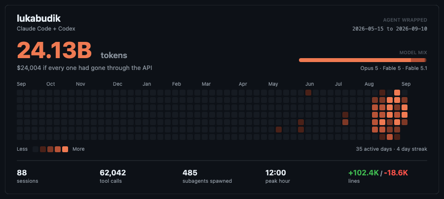
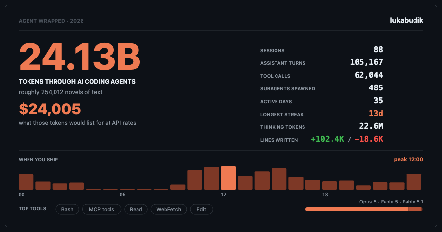
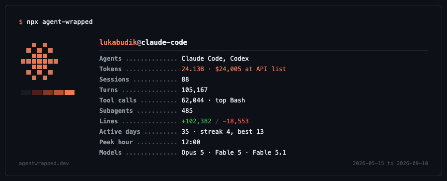

# agent-wrapped

Turn your local Claude Code and Codex transcripts into an SVG stats card for your GitHub profile README.

[](https://github.com/lukabudik/agent-wrapped/actions/workflows/ci.yml)
[](https://www.npmjs.com/package/agent-wrapped)
[](LICENSE)

Like [github-readme-stats](https://github.com/anuraghazra/github-readme-stats), but for the AI coding agent you actually spend your day with. It reads the session logs already sitting on your disk, adds up the tokens, prices them at list API rates, and gives you a card to embed.

For scale, from the author's own logs: **24.13 billion tokens**, worth **$24,006** at list API prices — roughly 17x what the subscription cost over the same period. (That dollar figure is a valuation of the tokens, not a bill anyone received. See [What gets measured](#what-gets-measured).)

> **Status: live, not yet on npm.** The service is running at [agentwrapped.dev](https://agentwrapped.dev) and the cards above are real. The npm package is not published yet, so `npx agent-wrapped` does not resolve — use the [single-file download](#install) below, which needs nothing but Node. Anything marked _(planned)_ is not built. Track progress in [TODO.md](TODO.md).

---

## The cards

Three themes. Same data, different pitch. All three are pure functions in `packages/core` — no browser, no headless Chrome, just a string of SVG.

### `heatmap` — a contribution graph for your agent



880x384. A 53-week grid in the coral ramp, so it reads as a sibling of GitHub's own contribution graph rather than a copy of it. Intensity thresholds are quartiles computed over your **active days only** — using the global maximum would flatten an ordinary week into level 1 the moment one outlier day exists, which is exactly what a heavy agent user's history looks like. Above the grid: a token hero, the dollar valuation, and a stacked bar of your model mix. Below it: sessions, tool calls, subagents spawned, peak hour, and lines added/removed.

### `wrapped` — the Spotify-Wrapped-style poster



880x452. A giant token count, the API-equivalent dollar figure, and a physical-scale equivalence line — "roughly N novels of text" — because a raw number at billion scale means nothing to a reader. On the right, a ledger of sessions, turns, tool calls, subagents, active days, longest streak, thinking tokens, and lines written. Below, a 24-bar hour-of-day chart with your peak hour lit in the accent color, plus chips for your top tools.

### `terminal` — a neofetch-style readout



880x344. A pixel sunburst logo next to monospace leader-dot rows, closed out with a neofetch-style palette strip. The rows are padded in characters rather than positioned in pixels, so the value column stays aligned no matter which font in the stack the viewer actually has.

### Light and dark

Every theme takes `mode=dark`, `mode=light`, or `mode=auto`.

`auto` emits a `prefers-color-scheme` media query inside the SVG and keys off the viewer's OS setting. The explicit modes pin one palette outright, which is what makes the `<picture>` snippet below able to match the GitHub theme exactly — a card is served to an ``, so no script runs and the page's theme is not observable from inside the card.

---

## Install

One file, no dependencies, no install step. Node 20+ is the only requirement:

```bash
curl -fsSL https://github.com/lukabudik/agent-wrapped/releases/latest/download/agent-wrapped.mjs -o agent-wrapped.mjs
node agent-wrapped.mjs
```

Once the npm package is published this becomes `npx agent-wrapped`; the bundled file will keep working either way.

## Quick start

See your stats, locally, without an account or a network call:

```bash
node agent-wrapped.mjs
```

Happy with them? Put the card on your profile:

```bash
node agent-wrapped.mjs publish
```

`publish` walks you through a GitHub device-flow login, shows you the exact JSON it is about to upload, waits for you to confirm, and then prints the markdown snippet to paste into your profile README.

---

## Embedding the card

The short version:

```markdown
[](https://agentwrapped.dev/u/YOUR_USERNAME)
```

`mode=auto` ships a `prefers-color-scheme` media query inside the SVG itself, which most browsers honor. If you want the light/dark switch to be guaranteed rather than merely likely, use `<picture>` — GitHub renders raw HTML in READMEs:

```html
<picture>
  <source
    media="(prefers-color-scheme: dark)"
    srcset="https://agentwrapped.dev/api/card/YOUR_USERNAME?theme=heatmap&mode=dark"
  />
  <source
    media="(prefers-color-scheme: light)"
    srcset="https://agentwrapped.dev/api/card/YOUR_USERNAME?theme=heatmap&mode=light"
  />
  
</picture>
```

Swap `theme=heatmap` for `wrapped` or `terminal`. The card is regenerated on the service each time you run `publish`; the URL stays stable.

---

## How it works

The awkward constraint at the center of this project: **the data only exists on your machine.**

Claude Code writes session transcripts to `~/.claude/projects/**/*.jsonl`. Codex writes to `~/.codex/sessions/**/*.jsonl`. Those files never leave your laptop, they are not in any repo, and no API exposes them. So the usual github-readme-stats design — a GitHub Action that regenerates a card on a schedule — is impossible here. A runner in GitHub's cloud has nothing to read.

That forces a split:

1. **The CLI reads and aggregates, locally.** It streams every `.jsonl` line by line (an 80MB transcript never lands in memory), pulls token usage off assistant messages, canonicalizes model ids, applies list pricing, and builds one aggregate object.
2. **You decide whether any of it leaves.** `npx agent-wrapped` with no arguments just prints a summary. `--out card.svg` renders locally. Only `publish` touches the network.
3. **The service stores aggregates and renders SVG.** It never sees a transcript, only the summary object. Cards are served from `/api/card/<username>`.

That is the whole design. It is more moving parts than a GitHub Action, and it is the only shape that works.

### Why the cards look the way they do

An SVG served to an `` is a sandboxed document. No script runs in it, and it cannot fetch anything external — no remote images, no webfonts. That single constraint drives most of the visual design: the cards use system font stacks rather than a nice typeface, and a drawn monogram rather than your GitHub avatar. Inlining an avatar as a data URI would technically work and would also roughly double the size of every card, on an asset GitHub re-fetches through its camo proxy. `renderCard` accepts an `avatarUrl` for API symmetry and deliberately ignores it.

Worth knowing before you fork this and spend an afternoon wondering why your font never loads.

### Cache tokens, and why the numbers are large

Agentic coding is cache-heavy. A long Claude Code session re-reads a large prompt prefix on every turn, and those cache reads are counted as tokens. That is why totals run into the billions where a chat-style workload would not. Pricing reflects it: cache reads bill at 0.1x the input rate (0.025x for Fable 5.1), 5-minute cache writes at 1.25x, 1-hour cache writes at 2x. The token count is real; the dollar figure prices each bucket at its own rate rather than pretending they all cost input price.

---

## Privacy

This is the part worth reading carefully, because the answer to "what does it upload" determines whether you should run it at all.

### What is uploaded when you run `publish`

Numbers and, optionally, names of first-party tools. Concretely:

- Token counts, split by input / output / cache read / cache write / thinking.
- The list-price dollar valuation of those tokens.
- Per-model breakdown: canonical model id, message count, tokens, dollars.
- Counts: sessions, assistant messages, tool calls, subagents spawned, lines added, lines removed.
- Activity shape: active days, current streak, longest streak, a date-to-count map for the heatmap, 24 hourly buckets, peak day, peak hour.
- Top tool names, subject to redaction (below).
- Your GitHub username and the date range covered.

### What is never uploaded

- Prompts, responses, thinking blocks, or any message content.
- File paths, file contents, diffs, repo names, or project directory names.
- Session ids. Sessions are counted locally; only the count is in the payload.
- Environment variables, git remotes, hostnames, or your local username.
- Anything from a `.jsonl` file that is not a number or a tool name.

### Redaction is on by default

Tool and skill names are the real leak surface. An MCP server named `mcp__acme-prod-billing__query` tells a reader where you work; a skill named after an internal system tells them what you work on. Neither of those is a token count.

So `safe` mode is the default:

| Kind                                                | `safe` (default)                               | `full` (opt-in)    |
| --------------------------------------------------- | ---------------------------------------------- | ------------------ |
| Built-in tools (`Bash`, `Read`, `Edit`, `Agent`, …) | published verbatim                             | published verbatim |
| MCP tools (`mcp__*`)                                | bucketed as **"MCP tools"**                    | real name          |
| Anything else                                       | bucketed as **"Other tools"**                  | real name          |
| Skills                                              | **omitted entirely** — only the count survives | real name          |

Opt into real names with `--include-names`. It is a deliberate flag, never a default, and never a prompt that nudges you toward yes.

### See the payload before you send it

```bash
npx agent-wrapped --json
```

That prints the exact object `publish` would upload, to stdout, with nothing sent anywhere. Pipe it to `jq`, diff it, read every field. `publish` also shows the payload and requires an explicit confirmation the first time you use it.

### Deleting your data

```bash
npx agent-wrapped delete
```

This erases your snapshot, your card, and your leaderboard entry. It prints exactly what will go and asks before doing it; pass `--yes` to skip the prompt in a script.

Identity comes from your GitHub token alone — there is no username in the request — so a token can only ever delete its own data. Snapshot and rate-limit rows cascade from the account row, so a single delete is the whole erasure.

Two things it deliberately does not touch: the login stored on your machine, so you can publish again without signing in twice (`agent-wrapped logout` is the command that forgets credentials), and your session logs, which were never uploaded in the first place.

---

## What gets measured

| Stat                  | Source                                                              |
| --------------------- | ------------------------------------------------------------------- |
| Total tokens          | `usage` on every assistant message, plus Codex `token_count` events |
| API-equivalent cost   | Each token bucket priced at its own list rate, per model            |
| Models used           | Canonical id, message count, tokens, and dollars per model          |
| Sessions              | Distinct session ids; subagent transcripts do not double-count      |
| Messages              | Assistant turns, including turns inside subagent transcripts        |
| Tool calls            | `tool_use` blocks, plus Codex `function_call` / `custom_tool_call`  |
| Subagents spawned     | `Agent` / `Task` tool calls                                         |
| Lines added / removed | Claude Code's own `cost-state` records                              |
| Active days, streaks  | Days with at least one assistant turn, local time                   |
| Heatmap and clock     | Per-day counts and 24 hourly buckets, local time                    |
| Peak day, peak hour   | The busiest of each                                                 |

### About the dollar figure

**It is a hypothetical valuation, not a bill.** Nobody was charged it.

The number answers exactly one question: _if every token in these transcripts had been bought through the first-party Anthropic API at published list prices, what would the invoice have said?_ That is a useful sense of scale for how much work an agent did, and it is the honest framing of what a subscription buys you.

What it is explicitly **not**:

- It is not what you paid. Claude Code subscribers pay a flat fee.
- It is not what Anthropic earned, or what the tokens cost to serve.
- It is not comparable to Bedrock or Vertex spend. Those are partner-priced and differ; the card quotes first-party list rates only.
- It is not a benchmark of skill, output quality, or anything else. Long sessions with heavy cache reads score high. That is a measure of context size, not of merit.

A model id the pricing table has never seen still needs a number, so it falls back to a mid-tier rate — $3 per million input, $15 per million output — rather than scoring zero or inheriting the top tier. That is a deliberate bias toward **under**-counting: a brand-new frontier model will be valued low until someone adds its real rates, which is the failure direction that does not inflate the headline figure. Pricing lives in one file, [`packages/core/src/pricing.ts`](packages/core/src/pricing.ts), precisely so you can check the rates yourself and send a PR when they change.

---

## Local-only usage

You never have to publish anything. The renderers live in `packages/core` and ship inside the CLI, so the service is not in the loop for any of this:

```bash
# Print a summary table and exit
npx agent-wrapped

# Only count activity since a date
npx agent-wrapped --since 2026-01-01

# Dump the raw aggregate
npx agent-wrapped --json > stats.json

# Render an SVG to disk, no network, no account
npx agent-wrapped render --out card.svg --theme wrapped --mode dark
```

`render` is its own subcommand, and `--out`/`--theme`/`--mode`/`--username` belong to it rather than to the default scan. The argument parser rejects unknown flags loudly instead of ignoring them, so `agent-wrapped --out card.svg` is an error, not a silent no-op. Defaults: `agent-wrapped.svg`, `heatmap`, `auto`, and your `git config user.name`.

Commit the SVG to your own repo and reference it there if you want a card without a service in the loop at all.

---

## Self-hosting

The web service is a standard Next.js app with Prisma and Postgres, deployable anywhere those run. It ships with [`apps/web/Dockerfile`](apps/web/Dockerfile), which builds from the repository root because the app depends on the `@agent-wrapped/core` workspace package. Railway is what it is developed against, but nothing in it is Railway-specific.

Railway's per-service settings, if you deploy there (its `railway.json` Config-as-Code format is deprecated and stops being read on 2026-12-01, so set these on the service instead):

| Setting            | Value                                                          |
| ------------------ | -------------------------------------------------------------- |
| Dockerfile path    | `apps/web/Dockerfile`                                          |
| Start command      | `node apps/web/server.js`                                      |
| Pre-deploy command | `prisma migrate deploy --schema apps/web/prisma/schema.prisma` |
| Healthcheck path   | `/api/health`                                                  |
| Watch paths        | `apps/web/**`, `packages/core/**`, `pnpm-lock.yaml`            |

Set `DATABASE_URL`, register your own GitHub OAuth app for device flow and set `GITHUB_CLIENT_ID` / `GITHUB_CLIENT_SECRET`, run the Prisma migrations, and deploy. Then point the CLI at your instance:

```bash
export AGENT_WRAPPED_API=https://wrapped.example.com
export AGENT_WRAPPED_CLIENT_ID=<your GitHub OAuth client id>
npx agent-wrapped publish
```

Nothing then goes near `agentwrapped.dev`. A step-by-step deployment guide is still to be written _(planned)_.

---

## Development

Requirements: Node 24, pnpm 11.

```bash
git clone https://github.com/lukabudik/agent-wrapped.git
cd agent-wrapped
pnpm install

pnpm typecheck
pnpm test
pnpm build
```

Layout:

```
packages/core    scanner, pricing table, redaction, SVG renderers
packages/cli     the npx binary
apps/web         Next.js service (Prisma + Postgres)
```

`packages/core` has no runtime dependencies and no network access by design. Everything that talks to the outside world lives in `packages/cli` or `apps/web`.

### Tests

`packages/core` carries 41 unit tests covering pricing math, model-id canonicalization, the scanner against both transcript formats, streak boundary cases, redaction, and SVG well-formedness including username escaping:

```bash
pnpm --filter @agent-wrapped/core test
```

They run against fixtures, not against your real transcripts, so they work on a machine that has never run an agent.

### Rendering a card without the CLI

The renderers are exported from `@agent-wrapped/core` and take a plain `WrappedStats` object, so you can drive them directly:

```ts
import { scan, renderCard } from "@agent-wrapped/core";

const stats = await scan();
const svg = renderCard(stats, { theme: "wrapped", mode: "auto", username: "lukabudik" });
```

`renderEmptyCard(username, mode, message?)` covers the not-published-yet case. The service uses it because GitHub proxies README images through camo — returning an error status would show every visitor a broken image icon, so an unknown user gets a real card that says so.

---

## Contributing

Yes, please. Especially:

- **Pricing corrections.** Rates move. [`pricing.ts`](packages/core/src/pricing.ts) is one table.
- **New agents.** Gemini CLI, Cursor, and Amp all write transcripts nobody has parsed yet.
- **Redaction gaps.** If you find a field that leaks something it should not, that is a security report, not a feature request — see [SECURITY.md](SECURITY.md).

Start with [CONTRIBUTING.md](CONTRIBUTING.md).

---

## License

[MIT](LICENSE) © 2026 Luka Budik

Not affiliated with Anthropic, OpenAI, or GitHub.
